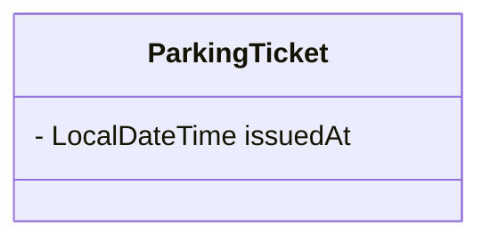

# Architecture

## Overview

The LLD Speedrun Gamifier is a two-tier Python application: a **Gradio frontend** that renders live Mermaid diagrams and a **FastAPI backend** that maintains a **canvas accumulator**—a running Mermaid string mutated on each correct answer. All game content is loaded from JSON config files; no static image assets or database required.

```
┌─────────────────────────────────────────────────────────┐
│                      Gradio UI                          │
│  ┌──────────────┐  ┌──────────────┐  ┌───────────────┐  │
│  │ Live Mermaid │  │ Question     │  │ Skill Tag &   │  │
│  │ Canvas       │  │ Components   │  │ Feedback      │  │
│  └──────────────┘  └──────────────┘  └───────────────┘  │
└───────────────────────────┬─────────────────────────────┘
                            │ HTTP REST
                            ▼
┌─────────────────────────────────────────────────────────┐
│                    FastAPI Engine                        │
│  ┌──────────────┐  ┌──────────────┐  ┌───────────────┐  │
│  │ Canvas       │  │ Answer       │  │ Mutation      │  │
│  │ Accumulator  │  │ Validator    │  │ Engine        │  │
│  └──────────────┘  └──────────────┘  └───────────────┘  │
└───────────────────────────┬─────────────────────────────┘
                            │ Reads
                            ▼
              ┌─────────────────────────────┐
              │  content/<system_id>/       │
              │    quiz_config.json         │
              └─────────────────────────────┘
```

## Components

### Gradio Frontend

Responsible for rendering the Blueprint Assembly experience:

- Render the live Mermaid diagram via `gr.Markdown` using backend-supplied canvas strings.
- Display the current question's `skill_tag` prominently.
- Dynamically render question widgets based on `type` (`radio`, `checkbox`).
- Reconstruct input layouts when transitioning between questions.
- Show instant feedback on failure—explanation contextualized to the skill constraint.

### FastAPI Backend

Responsible for game state, validation, and canvas mutations:

- **Game initialization:** Load a system pack from `content/<system_id>/`, parse and validate `quiz_config.json` via Pydantic.
- **Canvas accumulator:** Maintain a per-session Mermaid string, initialized to `classDiagram\n`.
- **Mutation engine:** On correct answer, apply the question's `uml_mutation` to the canvas (insert or update).
- **Retry buffer:** On incorrect answer, return failure without modifying the canvas.
- **Session management:** Track current level, answered questions, and applied mutations in memory.

## Canvas Accumulator

Each session starts with an empty diagram header:

```
classDiagram
```

On each correct answer, the mutation engine appends or replaces Mermaid syntax. The full canvas string is returned to the frontend for rendering:

````markdown

````

### Mutation Types

| Type | Behavior | Example |
|------|----------|---------|
| **Insert** | Append a new class block or association line | `class ParkingTicket {\n}\n` |
| **Update** | Replace an existing class block with an expanded version | `class ParkingTicket {\n    - LocalDateTime issuedAt\n}\n` |

The engine determines insert vs. update by checking whether the target class name already exists in the canvas string. Update mutations must supply the complete replacement block for that class.

## Planned API Surface

These endpoints are design targets—not yet implemented.

| Method | Endpoint | Purpose |
|--------|----------|---------|
| `GET` | `/systems` | List available LLD system packs |
| `POST` | `/game/start` | Start a session; returns initial empty canvas |
| `GET` | `/game/{session_id}/question` | Get current question (without answer/mutation) and canvas snapshot |
| `POST` | `/game/{session_id}/submit` | Submit answer; returns pass/fail, explanation, updated canvas |
| `GET` | `/game/{session_id}/canvas` | Get current Mermaid canvas string |

## Session Model (In-Memory)

```
Session {
  session_id: str
  system_id: str
  canvas: str                  # accumulated Mermaid string
  current_level: int           # 1-indexed
  current_question_index: int  # index within current level
  completed_questions: set[str]  # question_ids answered correctly
  applied_mutations: list[str]   # uml_mutation strings already applied
}
```

Sessions are ephemeral. Restarting the server clears all progress and canvas state.

## Data Validation

All config files are validated at load time using Pydantic models derived from [quiz-config-schema.md](quiz-config-schema.md). Invalid configs must fail fast with a clear error message—never partially load a broken system pack.

## Design Principles

1. **Constructive learning.** The diagram is built incrementally; every correct answer is a visible reward.
2. **Data-driven first.** Adding a new LLD system means adding a folder with `quiz_config.json`—no code changes.
3. **Fail fast.** Schema validation at startup; incorrect answers never corrupt canvas state.
4. **Zero asset dependency.** Mermaid strings replace static UML images entirely.
